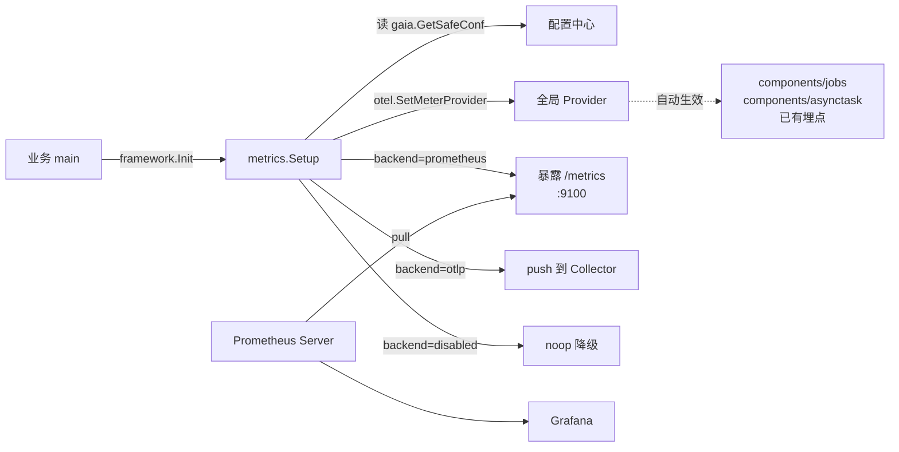

## framework/metrics

OTel Metrics 的 SDK 层一站式接入。把 [components/jobs](../../components/jobs)、[components/asynctask](../../components/asynctask) 等模块里通过 `otel.Meter(...)` 埋好的指标，**零代码、配置驱动**地接到 Prometheus / OTel Collector。

### 设计哲学

完全对齐 [framework/tracer](../tracer) 的风格：业务方只要 `framework.Init()` 跑过、配置打开，全局 `MeterProvider` 自动接管所有 SDK 内部埋点。



### 快速开始（3 步）

#### Step 1：在 `config.yml` 打开开关

```yaml
Framework:
  Metrics:
    Enabled: true
    Backend: prometheus      # prometheus | otlp | disabled
    Prometheus:
      ListenAddr: ":9100"
      Path: "/metrics"
```

#### Step 2：业务代码无需改动

`framework.Init()` 已在内部自动调用 `metrics.Setup(...)`。

> 如果你想手动控制（例如 main 里显式调用、或在 framework.Init 之前自定义），也可以：
> ```go
> shutdown, _ := metrics.Setup(context.Background(), "my-service")
> defer shutdown(context.Background())
> ```

#### Step 3：运行 Prometheus + Grafana

最小 docker-compose：

```yaml
services:
  prometheus:
    image: prom/prometheus
    volumes:
      - ./prometheus.yml:/etc/prometheus/prometheus.yml
    ports: ["9090:9090"]
  grafana:
    image: grafana/grafana
    ports: ["3000:3000"]
```

`prometheus.yml`：
```yaml
scrape_configs:
  - job_name: gaia
    scrape_interval: 15s
    static_configs:
      - targets: ['host.docker.internal:9100']
```

打开 `http://localhost:9090` 搜 `jobs_exec_total` / `asynctask_queue_depth` 即可看到指标，到 `http://localhost:3000` 配好 Prometheus 数据源后即可绘图。

---

### 配置项全表

| 配置 Key | 类型 | 默认值 | 说明 |
|---|---|---|---|
| `Framework.Metrics.Enabled` | bool | `false` | 总开关。**默认关闭**，避免对存量用户产生副作用 |
| `Framework.Metrics.Backend` | string | `prometheus` | `prometheus` / `otlp` / `disabled` |
| `Framework.Metrics.ServiceName` | string | `gaia.GetSystemEnName()` | resource.service.name 标签 |
| `Framework.Metrics.Prometheus.ListenAddr` | string | `:9100` | `/metrics` HTTP 监听地址；空串则不起 HTTP，由业务自行 mount `metrics.Handler()` |
| `Framework.Metrics.Prometheus.Path` | string | `/metrics` | HTTP 路径 |
| `Framework.Metrics.OTLP.Endpoint` | string | `localhost:4317` | OTLP gRPC 地址（指 Collector） |
| `Framework.Metrics.OTLP.Insecure` | bool | `true` | 是否使用明文 gRPC |
| `Framework.Metrics.OTLP.PushIntervalSec` | int | `10` | push 周期（秒） |
| `Environment` | string | `development` | resource.deployment.environment 标签 |

---

### 后端选择指南

| 后端 | 适用场景 | 典型部署 |
|---|---|---|
| `prometheus` | 单体服务、本地调试、私有云直接暴露 | Prometheus 拉 `/metrics` |
| `otlp` | 多服务多副本、需要在 Collector 里做处理（采样/路由/转换） | OpenTelemetry Collector → Prometheus / Tempo / Datadog |
| `disabled` | 临时关闭上报但保留埋点（compliance / 排障） | — |

---

### 与业务自有 HTTP server 共存

如果业务已经有自己的管理端口（如 admin :8888），不希望 metrics 单独再起一个端口：

```yaml
Framework:
  Metrics:
    Enabled: true
    Backend: prometheus
    Prometheus:
      ListenAddr: ""    # ← 留空，不起 HTTP
```

业务代码自行 mount：

```go
import "github.com/xxzhwl/gaia/framework/metrics"

mux.Handle("/metrics", metrics.Handler())
```

---

### 已经埋点覆盖的指标

详见各组件文档：

- [components/jobs/metrics.go](../../components/jobs/metrics.go)：`jobs.exec.total` / `jobs.exec.duration` / `jobs.lease.*` / `jobs.alarm.*` / ...
- [components/asynctask/metrics.go](../../components/asynctask/metrics.go)：`asynctask.queue.depth` / `asynctask.process.duration` / `asynctask.retry.total` / ...

> 注：OTel 指标名经 Prometheus exporter 转换后，所有 `.` 会变成 `_`。例如 `jobs.exec.total` → `jobs_exec_total`。

---

### 关闭与优雅退出

`metrics.Shutdown(ctx)` 会：
1. flush 残留指标（push 模式）；
2. 关闭 `/metrics` HTTP server（pull 模式）；
3. 释放 MeterProvider 资源。

进程退出前调用即可（与 `tracer.ShutdownTracer` 配合）：

```go
defer metrics.Shutdown(context.Background())
defer tracer.ShutdownTracer(context.Background())
```
